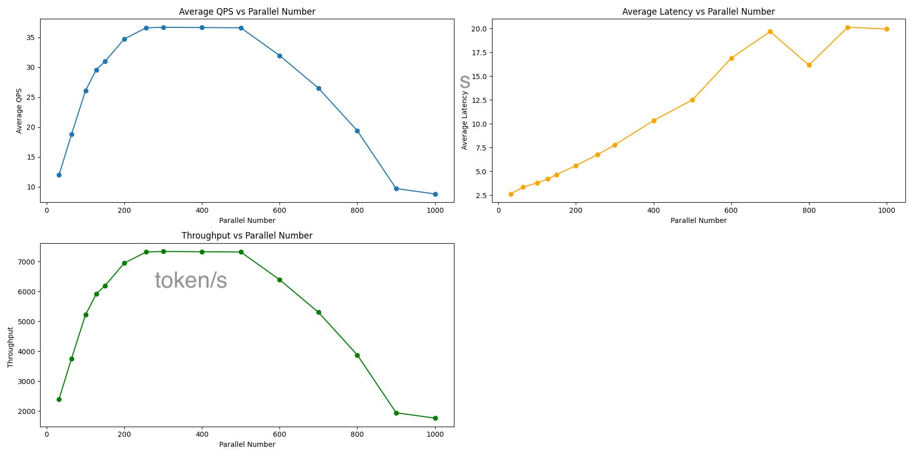

# Model inference performance stress test

## evalscope-perf help
```shell
evalscope-perf --help
```
                                                                                                                     
```
 Usage: evalscope-perf [OPTIONS] URL MODEL DATASET_PATH                                                                     
                                                                                                                            
╭─ Arguments ──────────────────────────────────────────────────────────────────────────────────────────────────────────────╮
│ *    url               TEXT  OpenAI URL [default: None] [required]
│ *    model             TEXT  模型名称 [default: None] [required]
│ *    dataset_path      TEXT  数据集路径 [default: None] [required]
╰──────────────────────────────────────────────────────────────────────────────────────────────────────────────────────────╯
╭─ Options ────────────────────────────────────────────────────────────────────────────────────────────────────────────────╮
│ --max-prompt-length         INTEGER  最大提示长度 [default: 256]
│ --stop                      TEXT     停止标记 [default: <|im_end|>]
│ --read-timeout              INTEGER  读取超时 [default: 30]
│ --parallels                 INTEGER  并行数 [default: 1]
│ --n                         INTEGER  请求数 [default: 1]
│ --install-completion                 Install completion for the current shell.
│ --show-completion                    Show completion for the current shell, to copy it or customize the installation.
│ --help                               Show this message and exit.
╰──────────────────────────────────────────────────────────────────────────────────────────────────────────────────────────╯
```


## Example
### Nvidia T4X4 - XInference(vLLM) - Qwen1.5-7B-Chat
```shell
evalscope-perf http://172.16.33.66:9997/v1/chat/completions gpt-4-32k \
    ./datasets/open_qa.jsonl \
    --parallels 4 \
    --parallels 8 \
    --parallels 16 \
    --n 20
```

### Ascend 910B4X8 - MindIE - DeepSeek-Coder-6.7B-Instruct
```shell
evalscope-perf http://127.0.0.1:1025/v1/chat/completions qwen \
    ./datasets/Codefuse-Evol-Instruct-Clean-data.jsonl \
    --parallels 32 \
    --parallels 64 \
    --parallels 100 \
    --parallels 128 \
    --parallels 150 \
    --parallels 200 \
    --parallels 256 \
    --parallels 300 \
    --parallels 400 \
    --parallels 500 \
    --parallels 600 \
    --parallels 700 \
    --parallels 800 \
    --parallels 900 \
    --parallels 1000 \
    --n 2000
```


